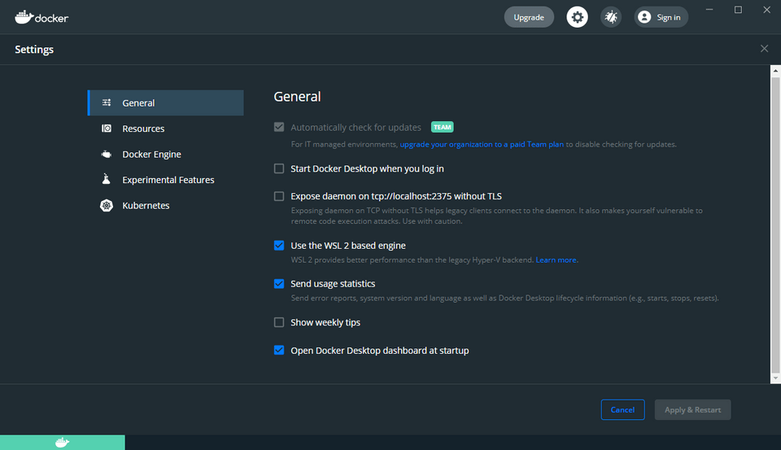
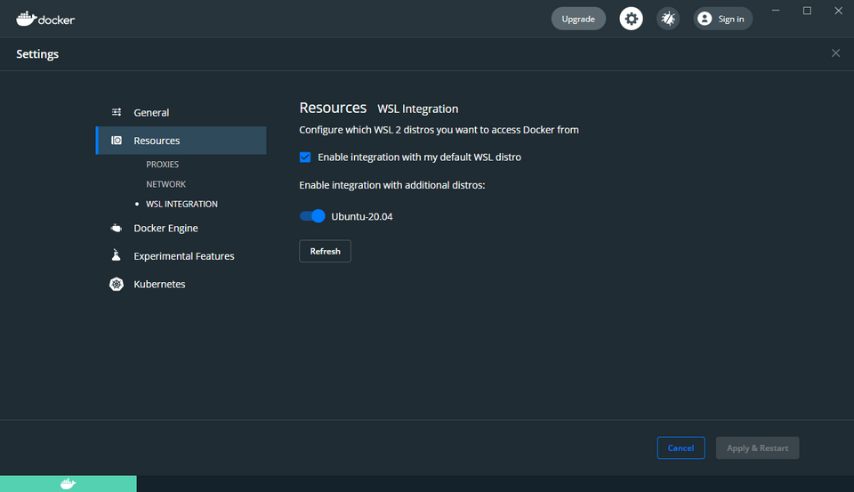
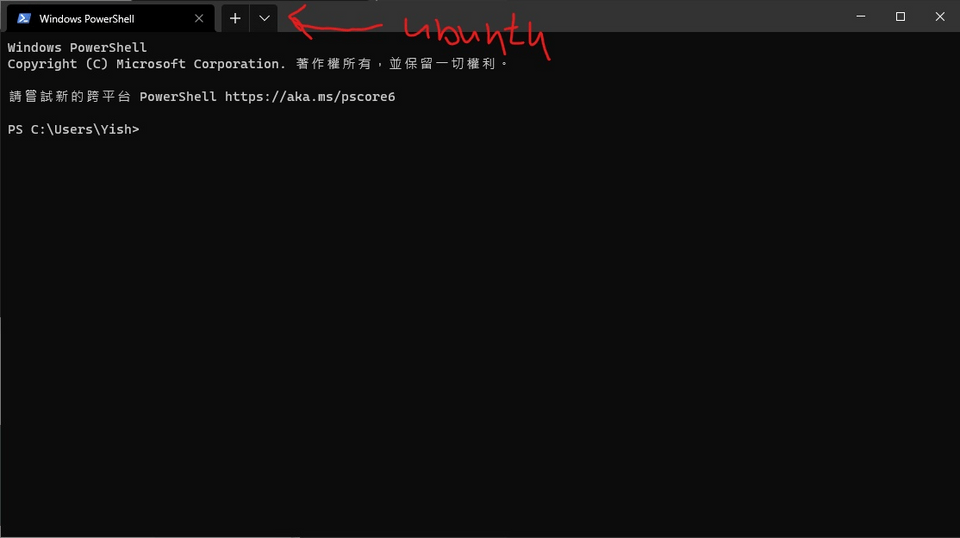

## Installation

Here is my installation notes, to be noticed, you should be upgraded your linux kernel on windows, the others just follow the documentation and step by step it will be okay.

1. Install docker desktop
2. Update linux kernel on windows https://docs.microsoft.com/en-us/windows/wsl/install-win10#step-4---download-the-linux-kernel-update-package
3. Check WSL documentation and step by step

   1. https://docs.microsoft.com/en-us/windows/wsl/install-win10
   2. Install your Linux distribution of choice: I used ubuntu 20.04 LTS, also you can choice what you want.
   3. Prompt input and type your account and allow permission
   4. Install windows terminal

4. Docker enabled

   

   

   

```bash
$ cd /mnt/c
$ mkdir Code
$ cd Code
$ curl -s https://laravel.build/example-app | bash
$ cd example-app
$./vendor/bin/sail up
```

Once the application's Docker containers have been started, you can access the application in your web browser at: http://localhost

## References

https://laravel.com/docs/8.x/installation#getting-started-on-windows

https://learnku.com/docs/laravel-development-environment/8.x/setting-up-the-sail-environment-under-windows-10/10352
